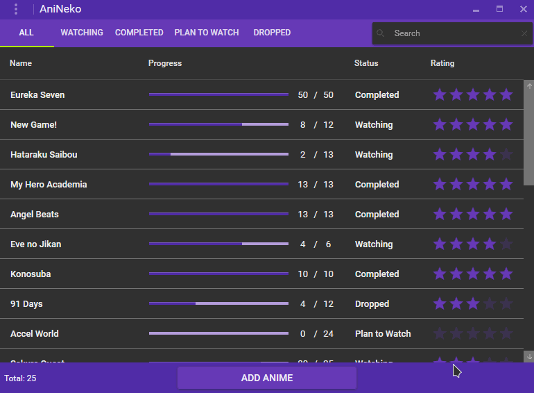

# AniNeko

AniNeko is a simple and lightweight application designed to list and track anime. It uses the [Material Design in XAML Toolkit](https://github.com/ButchersBoy/MaterialDesignInXamlToolkit "Material Design in XAML Toolkit") to give users a clean and easy to navigate UI.

    

 
